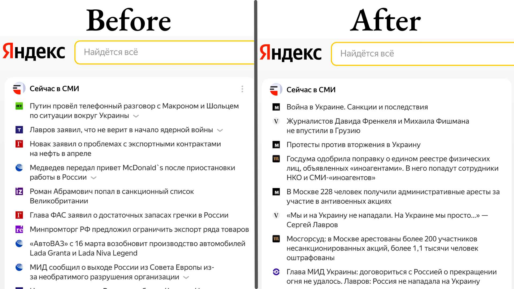

# Honest Yandex / Честный Яндекс



Yandex is a starting page of the internet starts for a large proportion of Russian citizens. Yet, the news block that
greets you every day only shows the news that the Russian government would like their citizens to see and mainly
consists of propaganda. Lev Gershenzon, the former head of Yandex news,
[urged](https://www.businessinsider.com.au/yandex-russia-former-news-director-urges-colleagues-quit-ukraine-invastion-2022-3)
his former colleagues to act and start showing the actual news articles by the remaining free news agencies instead of
promoting the state-sponsored propaganda press.

When the statement was published, well, nothing happened. Maybe Yandex doesn't know how to show the news from unbiased
news outlets. In this case, this browser extension can help them understand how it can be done.

---

Яндекс это страница являющаяся началом интернета для огромной части населения России. Но при этом, новостной блок
который пользователи видят каждый день показывает только те новости которые одобрены государством. Лев Гершензон, бывший
руководитель Яндекс Новостей, [призвал](https://www.facebook.com/lev.gershenzon/posts/10222700169425290)
бывших коллег публиковать заголовки из свободных СМИ вместо государственной пропаганды.

После публикации записи ничего не произошло. Возможно, Яндекс не знает как показывать новости из свободных СМИ вместо
пропаганды. В этом случае, это браузерное расширение покажет как это нужно делать.

## What is missing (TODO list)

* The extension only replaces the news on the front page. The _News_ tab still displays propaganda.
* The news sources are loaded directly, and most of them are likely to be completely blocked in Russia. Loading the news
  needs to happen through a proxy.

## Building

```shell
yarn install
yarn dist
```

## Installation

The extension can be installed by either building from sources or from a releases GitHub tab, and then loading it as
an [unpacked extension](https://developer.chrome.com/docs/extensions/mv3/getstarted/#unpacked).

Publishing the extension to the Chrome Marketplace is in progress.